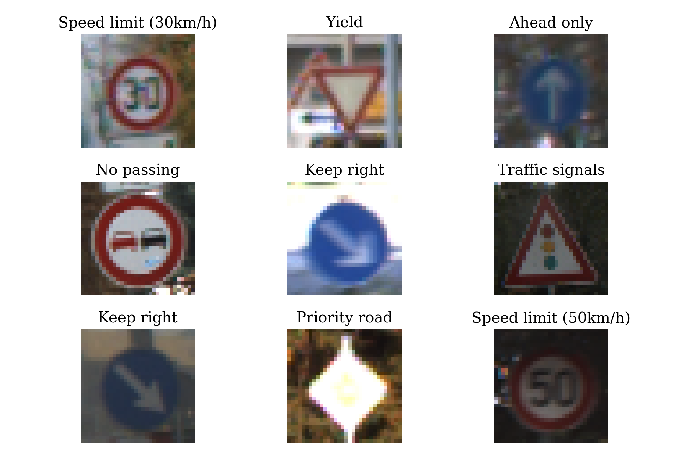
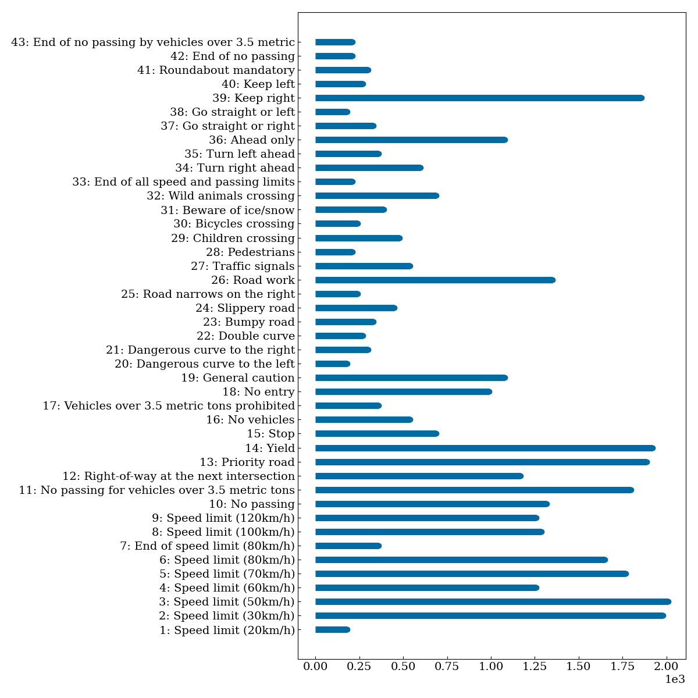
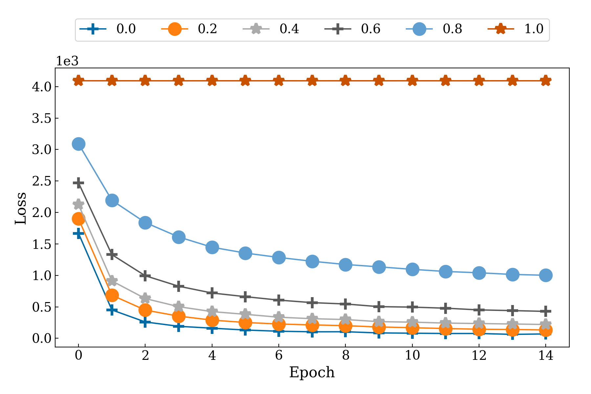
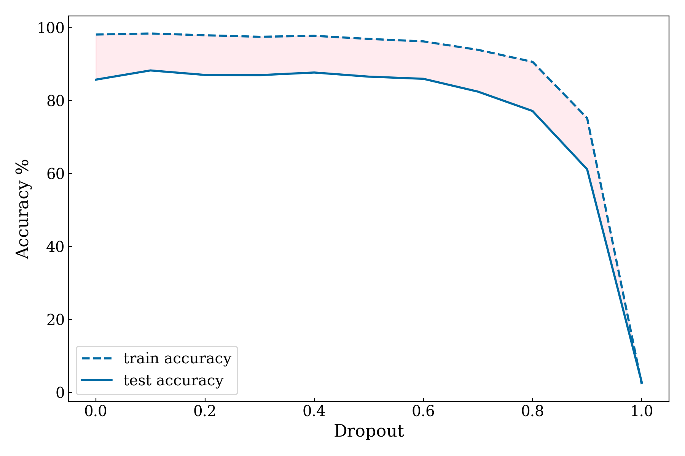
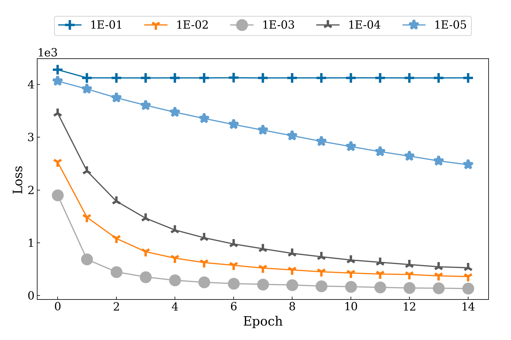
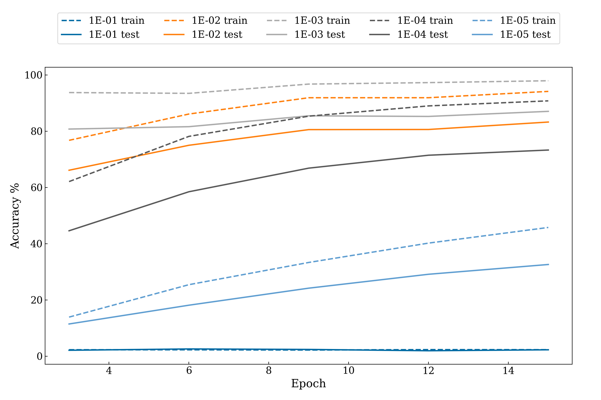

# 🚗 🛑
# Klasyfikacja znaków drogowych

Dawid Karpiński, 26.01.2024 r.

---

# 1. Specyfikacja danych

---

<style scoped>
h6 { font-size: 0.5em; margin-top: 0 !important }
</style>

## German Traffic Sign Dataset
[kaggle.com/datasets/harbhajansingh21/german-traffic-sign-dataset]()

- **43** unikalnych rodzajów znaków
- **34799** zdjęć do trenowania
- **4410** zdjęć do walidacji
- **12630** zdjęć do testowania
- **każde zdjęcie ma 32x32 px**

---



---

Dane były *niezbalansowane*

```python
from torch.utils.data import WeightedRandomSampler

samples_weights = 1 / counts

WeightedRandomSampler(
    weights=samples_weights,
    num_samples=len(samples_weights),
)
```



---

# 2. Model: CNN

---

<!-- TODO: do dopowiedzenia opis każdej warstwy -->

```python
# ConvDownBlock:
nn.Conv2d(...) -> nn.BatchNorm2d(...) -> nn.ReLU(...) -> nn.MaxPool2d(...)

# CNN
model = nn.Sequential(
    # (*, 3, 32, 32) -> (*, 8, 16, 16)
    ConvDownBlock(3, 8, 2, 1),
    # (*, 8, 16, 16) -> (*, 16, 8, 8)
    ConvDownBlock(8, 16, 2, 1),
    # (*, 16, 8, 8) -> (*, 32, 4, 4)
    ConvDownBlock(16, 32, 2, 1),
    #
    nn.Flatten(),
    nn.Dropout(dropout),
    #
    nn.Linear(512, 128),
    nn.ReLU(),
    nn.Linear(128, len(number_of_classes)),
)
```

---

# 3. Wyniki

---

## 3.1. Wpływ dropout

---



---



---

## 3.2. Wpływ learning rate

---



---



---

## 3.2. Confusion matrix

LR = 1e-03
dropout = 0.2

---


---


---


---


---


---

## 3.4. Confusion matrix

LR = 1e-04
dropout = 0.2

---


---


---

# Dziękuję za uwagę
